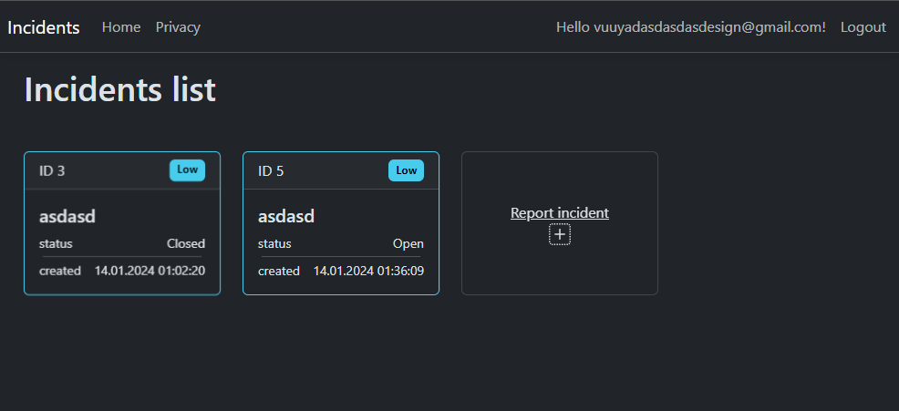
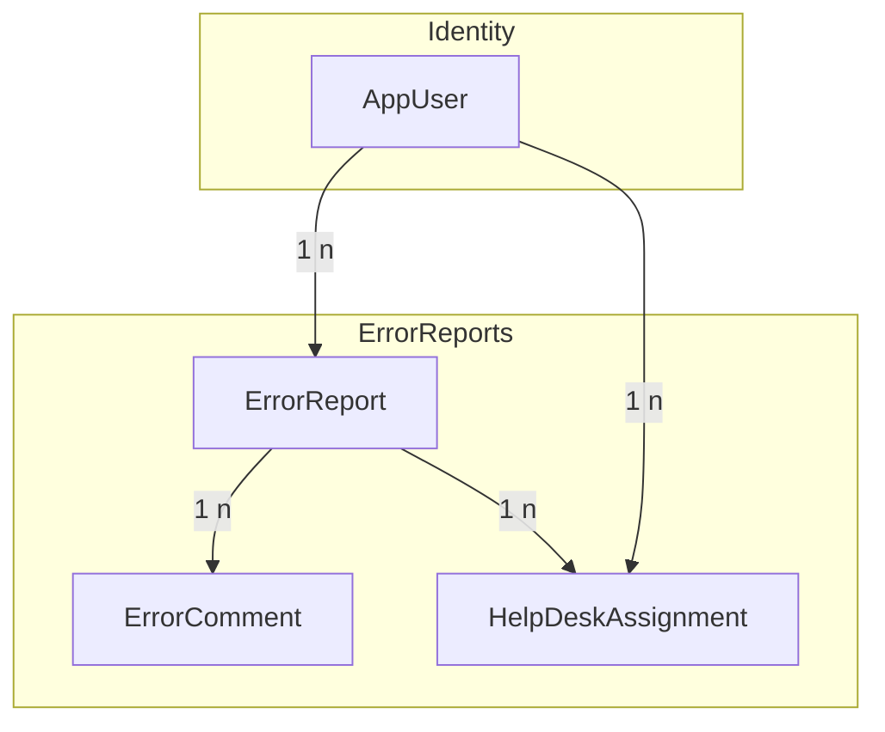

Incident Reports MVC Project
========================

Overview
--------



This is an ASP.NET Core MVC project for managing error reports with built-in authorization and authentication. The project is designed to handle error incidents, allowing users to create, view, edit, assign, and comment on error reports. The authentication system is integrated using ASP.NET Core Identity, and authorization is implemented using policies.

Table of Contents
-----------------

*   [Prerequisites](#prerequisites)
*   [Installation](#installation)
*   [Features](#features)
*   [Usage](#usage)
*   [Folder Structure](#folder-structure)
*   [License](#license)

Prerequisites
-------------

Make sure you have the following installed:

*   .NET SDK
*   [Visual Studio](https://visualstudio.microsoft.com/) or your preferred code editor

Installation
------------

1.  Clone the repository:
    
    ```bash
    git clone https://github.com/elkolorado/Incident-report-mvc.git
    ```
    
   
3.  Configure the database connection in the `appsettings.json` file.
    
4.  Run the following commands in the terminal at ErrorReports.csproj location:
    
    ```bash
    dotnet user-secrets set seeduserpw "<Password for Test Accounts>"
    ```
 5. Run the app  
    ```bash
    dotnet run
    ```
    


Features
--------

*   **Authentication and Authorization:** Utilizes ASP.NET Core Identity for user authentication and authorization. Users can register, log in, and perform actions based on their assigned roles.
    
*   **Error Report Management:**
    
    *   Create new error reports with details such as title, description, and priority.
    *   View a list of error reports based on authorization.
    *   Edit existing error reports, including title, description, status, and priority.
*   **Assignment:**
    
    *   Assign error reports to help desk users.
    *   View error reports assigned to the currently logged-in user.
*   **Comments:**
    
    *   Add comments to error reports.
    *   View comments associated with each error report.

Usage
-----

1.  **Registration and Login:**
    
    *   Users can register for an account or log in if they already have one.
2.  **Error Reports:**
    
    *   Navigate to the "Error Reports" section to view a list of authorized error reports.
    *   Create new error reports and assign them priorities.
3.  **Assignment:**
    
    *   Navigate to the "Assigned" section to view error reports assigned to the currently logged-in user.
4.  **Comments:**
    
    *   Add comments to error reports to provide additional information.
5.  **Authorization:**
    
    *   The application uses authorization policies to control access to specific actions and views based on user roles and permissions.

Folder Structure
----------------

*   **Areas:**
    
    *   Contains Identity-related data and configurations.
*   **Controllers:**
    
    *   Houses the `ErrorReportController` responsible for handling user requests related to error reports.
*   **Models:**
    
    *   Defines the data models, including `ErrorReport`, `ErrorComment`, `HelpDeskAssignment`, and `AppUser`.
*   **Migrations:**
    
    *   Contains database migration files.
*   **Views:**
    
    *   Includes Razor views for rendering the UI.
*   **Authorization:**
    
    *   Implements custom authorization policies and operations for error reports.

Classes
-------


License
-------

This project is licensed under the MIT License.

* * *

Feel free to customize, extend, and enhance this project based on your specific requirements. If you have any questions or suggestions, please open an issue or contribute to the project.